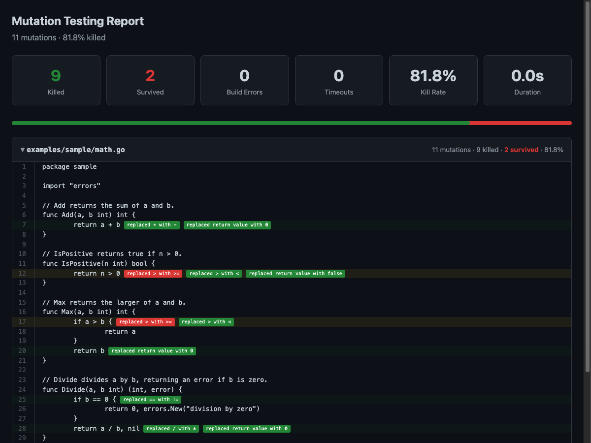

# mutagen

Mutation testing engine for Go. Mutates your code, runs your tests, and reports which changes your tests failed to catch. ([What is mutation testing?](#what-is-mutation-testing))



## Install

```
make install
```

Or directly: `go install ./cmd/mutagen/`

## Usage

```
mutagen ./...                       # test all packages
mutagen -diff main ./...            # only test changed lines (CI mode)
mutagen -per-test ./...             # target only relevant tests per mutation
mutagen -threshold 80 ./...         # fail if kill rate < 80%
mutagen -html report.html ./...     # generate HTML report
mutagen -output json ./...          # JSON output for CI
```

Results are cached between runs — unchanged code is skipped automatically.

## Make targets

```
make test          # run unit tests
make mutate        # run mutation testing on this repo
make mutate-html   # same, with HTML report
```

## Reports

Use `-html report.html` to generate a source-annotated HTML report. Files are sorted by surviving mutation count (worst first), with inline badges showing each mutation and its status. Use `-output json` for machine-readable output or `-output text` (default) for terminal.

## Config

Copy `mutagen.example.yaml` to `.mutagen.yaml` in your project root. All fields are optional — CLI flags override the config file. Uncomment `mutators` to restrict which operators run, or `diff` to always run in diff-only mode.

## What is mutation testing?

Coverage tells you what runs. It says nothing about what gets checked. **A test that calls a function and ignores the result gets 100% coverage and catches zero bugs.**

Mutation testing changes your code and checks if tests notice. `+` becomes `-`, `==` becomes `!=`, an `if err != nil` guard disappears. If tests still pass after a change, that mutation *survived*: your tests don't verify that behavior. If a test fails, the mutation is *killed*: caught.

Kill rate (killed / total) is a better measure than coverage. 90% coverage with 60% kill rate means tests that touch code but don't check it. 70% coverage with 85% kill rate means fewer tests that actually work.

### Operators

| Category | What changes |
|---|---|
| Arithmetic | `+` ↔ `-`, `*` ↔ `/`, `%` → `*` |
| Comparison | `>` ↔ `>=`, `<` ↔ `<=`, `==` ↔ `!=` |
| Logical | `&&` ↔ `\|\|` |
| Boolean | `true` ↔ `false` |
| Nil checks | `if err != nil { return err }` → removed |
| Return values | non-zero returns → zero value |
| Assignment | `+=` ↔ `-=`, `*=` ↔ `/=` |
| Branch removal | else blocks emptied, case bodies emptied |
| Bitwise | `&` ↔ `\|`, `^` → `&`, `<<` ↔ `>>` |

### Performance

Only mutates lines your tests cover. Runs in parallel using Go's `-overlay` flag (source files are never touched). Caches results between runs. `-per-test` maps each test to the lines it covers, then runs only those tests per mutation instead of the full suite. `-diff main` restricts mutations to changed lines. Skips generated code, vendored deps, and logging/boilerplate automatically.
